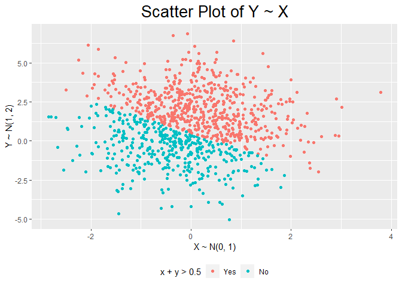
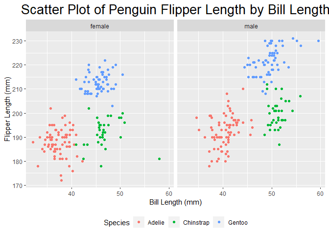

PubH7462_HW1_panxx408
================
Mingming Pan
2/2/2022

#### Problem 2.1 Independent Bivariate Normal Random Sample

``` r
#Create Tibble
set.seed(7462)
Tibble_2.1 <- tibble(x = rnorm(1000, 0, 1),
       y = rnorm(1000, 1, 2),
       sum_indicator = ifelse(x + y >0.5, TRUE, FALSE))
Tibble_2.1 <- Tibble_2.1 %>%
  mutate(sum_indicator_new = as.factor(ifelse(sum_indicator == "TRUE", "Yes", "No"))) 

#Reorder the factor that Yes comes before No
Tibble_2.1$sum_indicator_new <- forcats::fct_relevel(Tibble_2.1$sum_indicator_new,
                                                     "Yes", "No")
```

``` r
#Scatter plot of Y ~ X
Plot_2.1 <- ggplot(data = Tibble_2.1, aes(x = x, y= y, color = sum_indicator_new)) +
  geom_point() +
  labs(title = "Scatter Plot of Y ~ X", 
       x ="X ~ N(0, 1)", 
       y = "Y ~ N(1, 2)",
       color = "x + y > 0.5") +
  theme(plot.title = element_text(hjust = 0.5, size = 20), 
        legend.position = "bottom" )
Plot_2.1
```

<!-- -->
#### Problem2.2 Penguin EDA

``` r
#read data with relative path
penguin_df <- read_rds("./data/penguin.RDS")
```

#### Problem 2.2.1 Data Description

-   Penguin data set describes the Size measurements for adult foraging
    penguins near Palmer Station, Antarctica.
-   There are 344 rows and 8 columns
-   Variables are: **species**: a factor denoting penguin species
    (Adélie, Chinstrap and Gentoo);**island**: a factor denoting island
    in Palmer Archipelago, Antarctica (Biscoe, Dream or
    Torgersen);**bill_length_mm**: a number denoting bill length
    (millimeters); **bill_depth_mm**: a number denoting bill depth
    (millimeters); **flipper_length_mm**: an integer denoting flipper
    length (millimeters); **body_mass_g**: an integer denoting body mass
    (grams); **sex**: a factor denoting penguin sex (female, male);
    **year**: an integer denoting the study year (2007, 2008, or 2009).
-   The mean of flipper length is 200.92(mm), and the standard deviation
    is 14.06(mm). The mean of bill length is 43.92(mm) and the standard
    deviation is 5.46(mm).

#### Problem2.2.2 Visualization

``` r
#Remove NA of bill length, flipper Length, and sex
penguin_clean <- penguin_df %>%
  filter(!is.na(flipper_length_mm), !is.na(bill_length_mm), !is.na(sex))
#Scatter plot of flipper length ~ bill length 
Plot_2.2 <- ggplot(data = penguin_clean, aes(x = bill_length_mm, y = flipper_length_mm, 
                                          color = species)) +
  geom_point() +
  facet_wrap(vars(sex)) +
  labs(title = "Scatter Plot of Penguin Flipper Length by Bill Length", 
       x = "Bill Length (mm)", 
       y = "Flipper Length (mm)",
       color = "Species") +
  theme(plot.title = element_text(hjust = 0.5 ,size = 20), 
        legend.position = "bottom" )
Plot_2.2
```

<!-- -->

Male penguins tend to have larger bill length and larger flipper length
than female penguins overall (ignoring the species).
